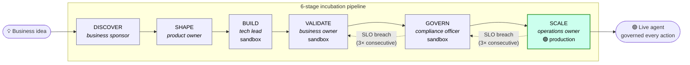
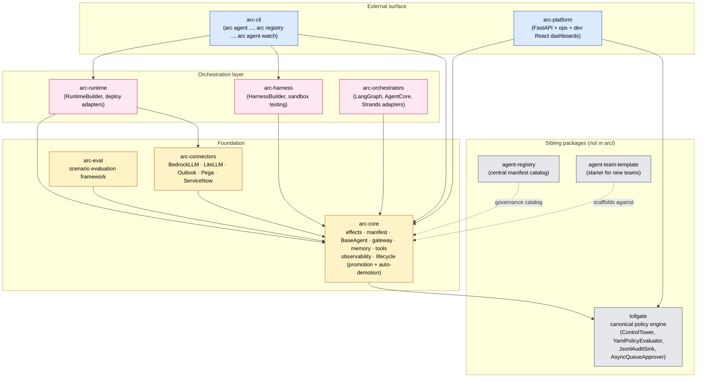
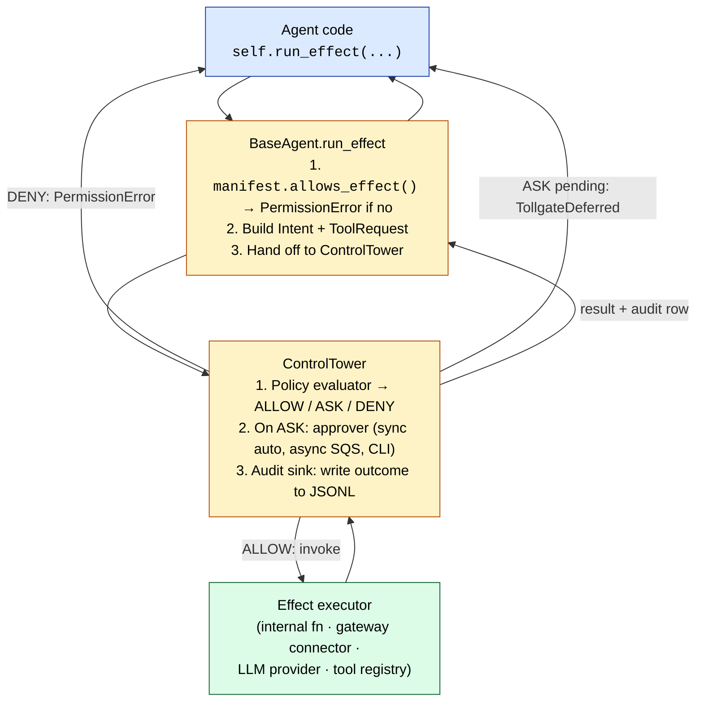
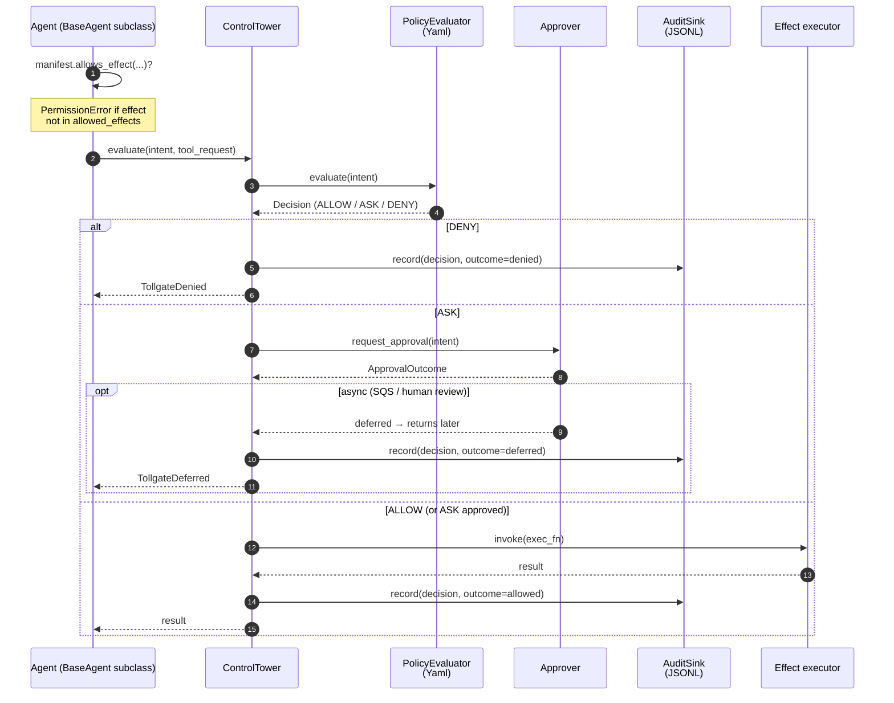
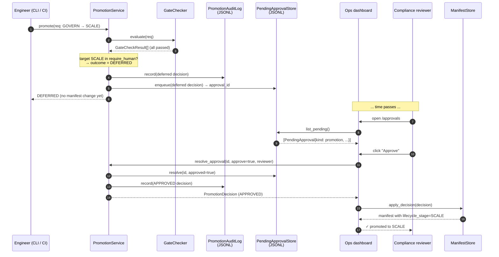
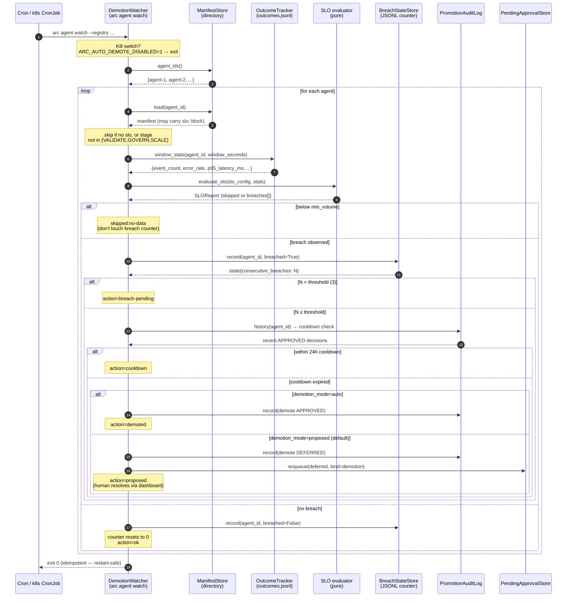
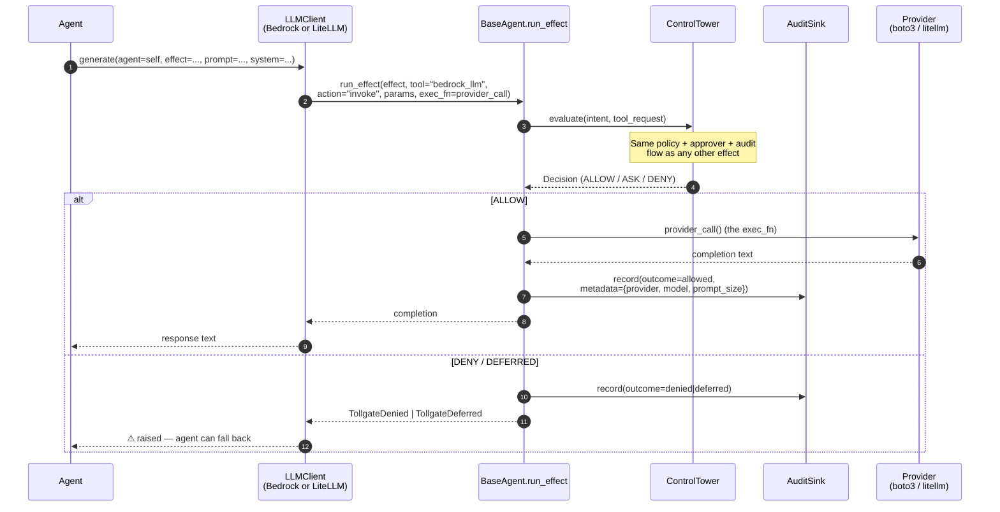
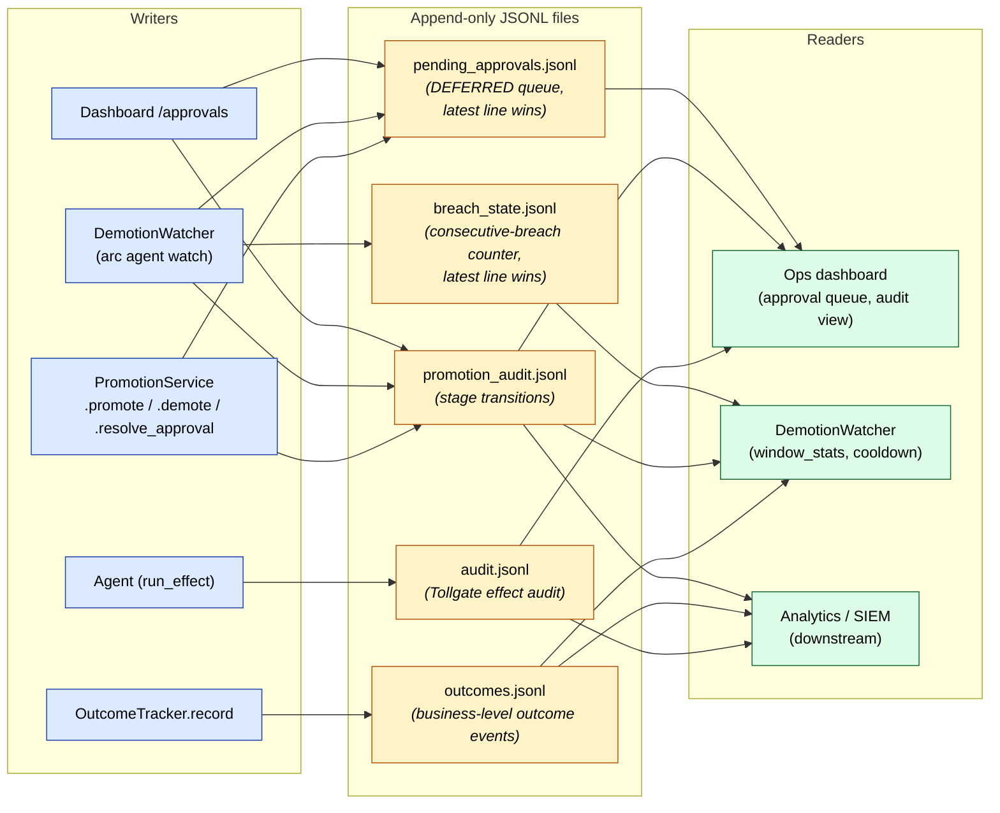

# Architecture diagrams

Visual companion to [architecture.md](architecture.md). Eight diagrams,
ordered from highest level (one-page platform picture) to lowest level
(sequence diagrams of individual call paths + the data artifact map).

> All diagrams are **Mermaid** — they render natively in the GitHub web
> view and live in the repo as plain text. No external tool needed.

---

## 1. Platform at a glance

The whole platform in one picture: an idea enters at DISCOVER and an
agent that has earned production trust exits at SCALE. Auto-demotion
provides the fall-back arrow when SLOs breach in production.

Each stage has an **entry criteria checklist**, **exit artifacts**, and a
**named reviewer role** (defined in [`stages.py`](../arc/packages/arc-core/src/arc/core/lifecycle/stages.py)).
The dashed lines are the auto-demotion path covered in §6.

---

## 2. Package architecture

Where the code lives. `arc/packages/` is a Python monorepo with seven
packages plus three siblings (`tollgate/`, `agent-registry/`,
`agent-team-template/`).

Read this as a strict dependency graph: arrows point from consumer to
producer. Foundation packages know nothing about orchestration or the
external surface. Tollgate is a **sibling** package, not a child — it's
intentionally swappable.

---

## 3. Layered governance — every action funnels through the same stack

The platform's central claim: *every* effect — internal compute, an
external API call, an LLM prompt — travels the same governance path. No
back doors.

Two non-obvious properties:
- **The agent never decides whether to run** — it only declares intent. ControlTower decides.
- **The audit row is written before the executor returns** — even on a panic, the audit trail captures the decision.

---

## 4. Sequence: one effect call

The canonical end-to-end flow when an agent calls `self.run_effect(...)`.
Every column is a real object you can grep for in the codebase.

Audit rows always land — even on DENY and DEFERRED. That's the central
property compliance reviews care about.

---

## 5. Sequence: SCALE promotion with human approval

The DEFERRED → human → resolved flow. The promotion is split across
three actors and lands in three persistent stores; the dashboard is the
only synchronous human touchpoint.

Same pattern works for any stage in `require_human`. Reject path is
symmetric — just `approve=false` and no `apply_decision` call.

---

## 6. Sequence: auto-demotion watcher pass

What happens on each `arc agent watch` invocation. Stateless by
design — every signal is read fresh from disk so the watcher is safe
on a 5-min cron.

Read this as four guards stacked: kill switch → eligibility (stage +
SLO presence) → min_volume floor → 3-evaluation hysteresis → 24h
cooldown. Only after **all** five pass does the watcher fire.

---

## 7. Sequence: LLM call with policy

LLMs are not special. The `LLMClient` Protocol routes every model call
through `agent.run_effect()` so prompt size, model id, and provider land
in the same audit row as any tool call.

The `LLMClient` is **stateless w.r.t. the agent** — `agent` is a
per-call argument, not a constructor argument. One client instance is
shared safely across agents. Provider selection is governed by
[`LLMConfig`](concepts/llm-clients.md): platform default ←
manifest override ← `with_llm()` explicit injection.

---

## 8. Data artifacts — who reads, who writes

Five JSONL files own all of the platform's persistent state. All
append-only, all crash-safe (a torn line is just skipped on read).

Two of the files (`breach_state`, `pending_approvals`) use a
**latest-line-wins** convention so the file remains append-only while
still representing mutable state — a state change appends a new line
with the same key, and readers reconstruct by walking the file.

---

## How to update these diagrams

When code changes break a diagram:
1. Update the diagram in this file alongside the code change in the
   same commit (don't let docs drift).
2. Mermaid is plain text — diff it like any other code.
3. To preview locally: paste the block into [mermaid.live](https://mermaid.live/),
   or open the file on GitHub.

When adding a **new** diagram:
- Slot it where it belongs in the high → low order.
- Keep one purpose per diagram. If you find yourself drawing two
  things, split them.
- Use Mermaid only — no SVG / PNG. Plain text round-trips through PR
  review.

---

## Where to read next

- [Architecture](architecture.md) — prose narrative of the same picture.
- [Lifecycle](concepts/lifecycle.md) — deep dive on stages, promotion,
  and auto-demotion (diagrams 1, 5, 6).
- [Governance](concepts/governance.md) — deep dive on the layered
  funnel (diagrams 3, 4).
- [LLM clients](concepts/llm-clients.md) — deep dive on the LLM call
  path (diagram 7).
- [Demo plan](guides/demo.md) — runs through the diagrams as a live
  walkthrough.
- [Roadmap](roadmap.md) — what's shipped vs in flight.
