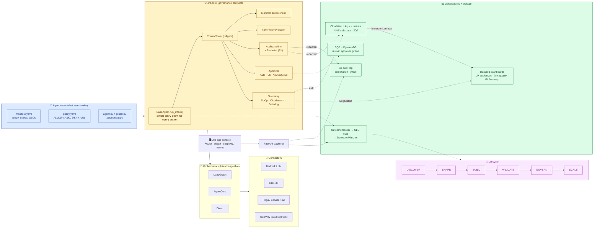
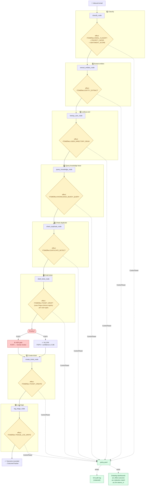

# Arc — architecture overview

Two diagrams for sharing with stakeholders. The first shows the
platform shape; the second shows it in action with a real agent.

> Both diagrams are Mermaid — they render natively in GitHub,
> Notion, Confluence, and any Markdown tool. For PowerPoint, paste
> into [mermaid.live](https://mermaid.live) and export PNG/SVG.

---

## 1. Platform architecture (high-level)

What every arc agent inherits and where each component lives. Built
left-to-right: agent code on the left, the governance core in the
middle, observability + storage on the right.

### Reading the diagram

- **Blue (left):** what an agent team writes. A YAML manifest, a YAML
  policy, the business code. Three files, no platform code.
- **Yellow (centre):** the governance contract. Every action goes
  through `BaseAgent.run_effect()` → `ControlTower`. Manifest scope,
  policy, audit, approval, telemetry — all wired here, all
  non-bypassable.
- **Grey (orchestrators + connectors):** interchangeable substrates.
  Swap LangGraph → AgentCore without touching governance. Swap
  Bedrock → LiteLLM without touching audit shape.
- **Green (right):** where humans look. S3 for compliance auditors
  (years), CloudWatch as the AWS substrate (days), Datadog dashboards
  for ops + compliance leads. Every signal here is derived from the
  governance core; nothing is bolted on.
- **Purple (bottom):** lifecycle. Six stages with promotion gates,
  SLO-driven auto-demotion, manifest store. Governance over time, not
  just per-call.

### What's NOT in the picture (honest gaps)

- **Multi-tenancy** — single-tenant today
- **Identity for agents** — manifest-declared, not cryptographically
  signed
- **In-flight cancel** — backlog item; today's interrupts are ASK
  gates + suspend kill switch
- **Streaming under AgentCore** — adapter scaffold present, streaming
  TODO

---

## 2. Email triage flow (real agent in motion)

The `email-triage` agent processes one inbound email through nine
governed nodes. Every node fires through `run_effect`, so every action
appears in the audit log + telemetry stream.

### What this flow proves

- **Eight effects per email** — every meaningful action is governed.
  None of them can run without `policy.yaml` saying it can.
- **PII redacted at the boundary** — the `Redactor` runs before any
  LLM call (Bedrock / LiteLLM) and before audit-row write. The agent
  sees real values; the LLM provider and audit storage see redacted.
- **Human-in-the-loop where it matters** — P1/P2 priority emails hit
  the `TICKET_CREATE` ASK gate. P3/P4 with high confidence go
  straight through. Same code path, policy decides.
- **Cost-tracked end-to-end** — `arc.llm.tokens_in` per effect lets
  you compute "cost per email triaged" and break it down by
  classification model vs. drafting model.
- **One audit row per effect** — eight rows per email in S3.
  Replayable, queryable from Athena, redacted of PII.
- **Three telemetry signals visible to ops** — decision distribution,
  effect latency, redaction match counts. All in Datadog within ~2
  minutes of each run.

### What changes if you run this on AgentCore instead

**Almost nothing.** The orchestrator routes the LangGraph graph to
Bedrock AgentCore's runtime instead of in-process, and that's it.
Same nine nodes, same eight effects, same policy file, same audit
shape, same telemetry vocabulary.

The portability demo (`demos/agentcore-portability/`) proves this
end-to-end with a minimal agent. The architectural claim holds for
email-triage too because every arc agent inherits the same governance
contract.
