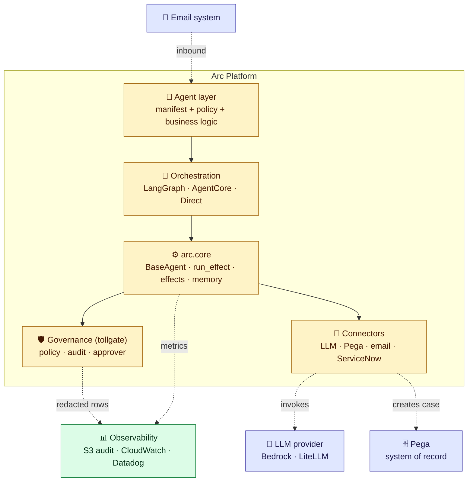
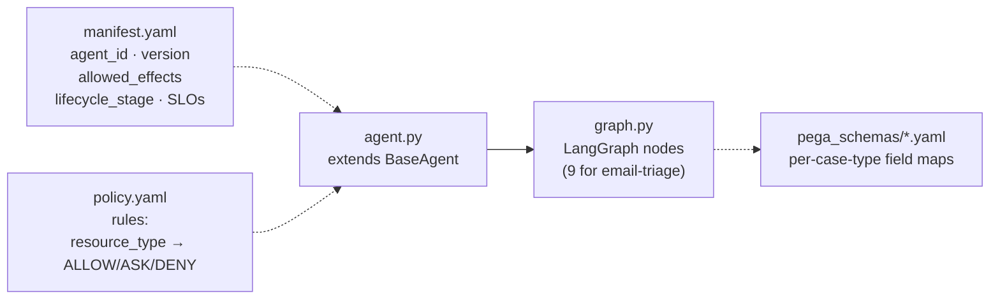
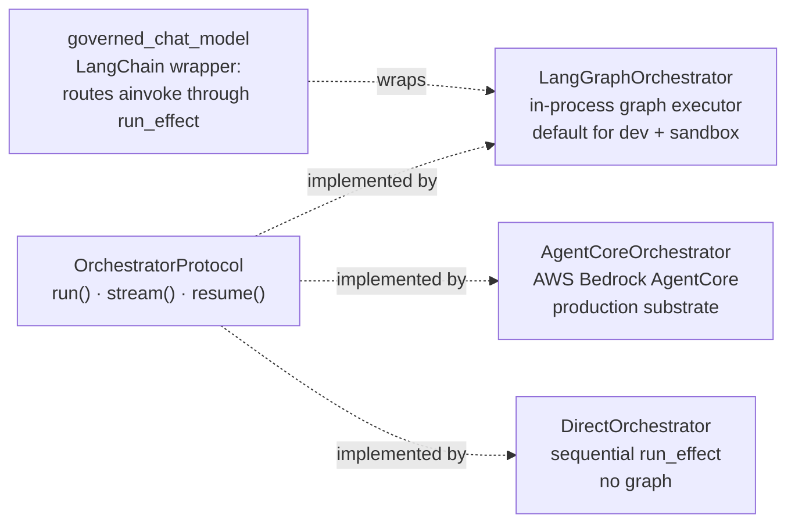
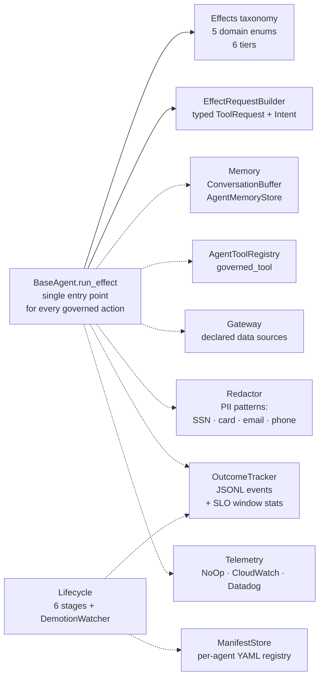
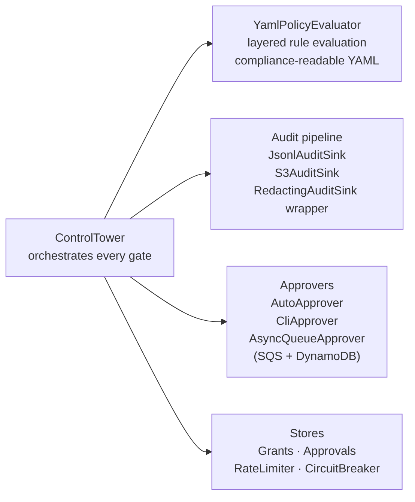
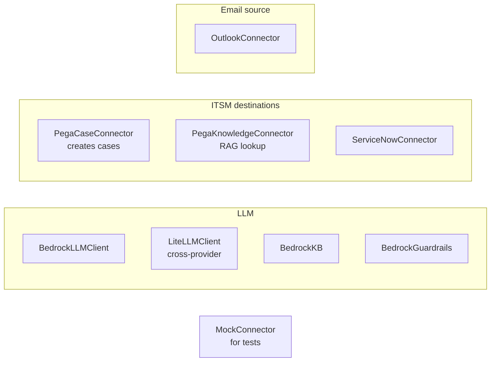
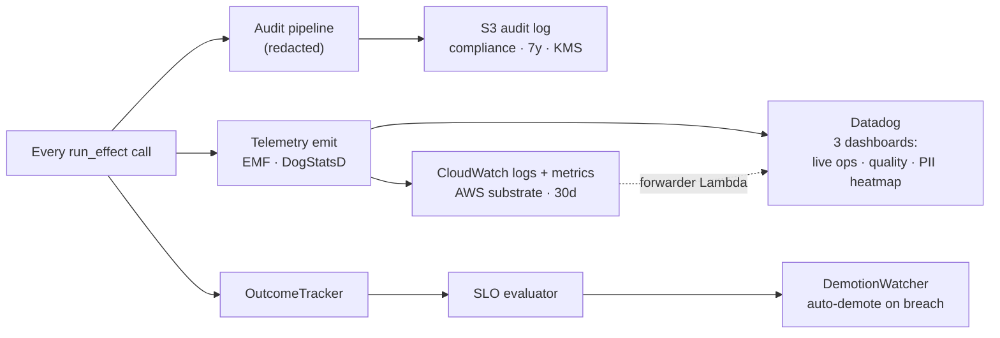
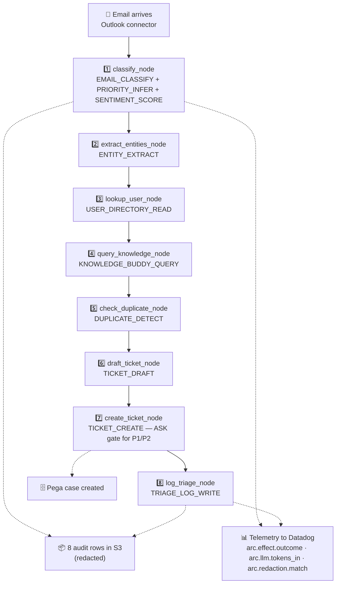

# Arc — component map

One high-level diagram of the arc platform, then a drill-down per
major block. The high-level reads in 30 seconds; the drill-downs are
there when someone asks "what's in that box?"

> Every diagram below uses only `-->` and `-.->` arrows so it renders
> cleanly on GitHub, Notion, Confluence, and mermaid.live.

---

## High-level — the 30-second view

Six blocks. Solid arrows = composition (how the platform is built).
Dotted arrows = data flow at runtime (email in, Pega + audit out).



| Block | What it does | One-line summary |
|---|---|---|
| 🧩 **Agent layer** | What teams write | manifest.yaml + policy.yaml + agent.py + graph.py |
| 🔀 **Orchestration** | Runs the graph | LangGraph in-process today; AgentCore for AWS deployment |
| ⚙️ **arc.core** | Governance contract | `BaseAgent.run_effect()` is the only entry point for any action |
| 🛡️ **Governance (tollgate)** | Policy + audit + approve | Every effect goes through here; non-bypassable |
| 🔌 **Connectors** | Talks to external systems | Bedrock, LiteLLM, Pega, Outlook, ServiceNow |
| 📊 **Observability** | Where humans look | S3 (audit) + CloudWatch (substrate) + Datadog (dashboards) |

---

## 🧩 Agent layer — drill-down

What an agent team writes for one agent. Three files; everything else is inherited from arc.



| File | Responsibility |
|---|---|
| **manifest.yaml** | Declared scope: `agent_id`, `version`, `allowed_effects`, `lifecycle_stage`, SLOs, owner |
| **policy.yaml** | Per-agent decision rules — `ALLOW` / `ASK` / `DENY` keyed on `resource_type` |
| **agent.py** | Business class extending `BaseAgent`. Implements `execute()` |
| **graph.py** | LangGraph node definitions; 9 nodes for email-triage |
| **pega_schemas/*.yaml** | Per-case-type Pega field maps (distribution, hardship, sponsor) |

---

## 🔀 Orchestration — drill-down

Interchangeable runtimes. All implement the same `OrchestratorProtocol`, so swapping one for another doesn't touch governance code.



| Component | Responsibility |
|---|---|
| **LangGraphOrchestrator** | Runs the LangGraph in-process; default for dev + sandbox |
| **AgentCoreOrchestrator** | Forwards to AWS Bedrock AgentCore runtime |
| **DirectOrchestrator** | Sequential `run_effect` calls; no graph; for simple agents |
| **governed_chat_model** | Wraps any LangChain `BaseChatModel` so `ainvoke` routes through `run_effect` |

---

## ⚙️ arc.core — drill-down

The governance contract every agent inherits. Shown as inputs (manifest, declarations) → engine (`BaseAgent.run_effect`) → outputs (governance, observability).



| Component | Responsibility |
|---|---|
| **BaseAgent.run_effect()** | The only path an agent can take to execute any action |
| **Effects taxonomy** | `FinancialEffect`, `ITSMEffect`, `HealthcareEffect`, `LegalEffect`, `ComplianceEffect` × 6 tiers |
| **EffectRequestBuilder** | Builds typed `ToolRequest` + `Intent` for ControlTower |
| **Memory** | `ConversationBuffer` + `AgentMemoryStore` (Local JSON or DynamoDB) |
| **AgentToolRegistry** | `@governed_tool` decorator + tool registration |
| **Gateway** | Declared data sources: `MockGatewayConnector`, `HttpGateway`, `MultiGateway` |
| **Redactor** | Pattern-based PII redaction at LLM + audit boundaries |
| **OutcomeTracker** | Records outcome events for ROI + SLO window stats |
| **Telemetry** | Three implementations: `NoOpTelemetry`, `CloudWatchEMFTelemetry`, `DatadogTelemetry` |
| **Lifecycle** | 6-stage promotion pipeline + `DemotionWatcher` (auto-demotion on SLO breach) |
| **ManifestStore** | Per-agent YAML registry; source of truth for scope + status |

---

## 🛡️ Governance (tollgate) — drill-down

The trust boundary. Lives in a separate sibling package — easier to audit on its own. Every `run_effect` call routes through `ControlTower`, which fans out to four pieces.



| Component | Responsibility |
|---|---|
| **ControlTower** | Orchestrates every gate: policy → audit → approver → telemetry |
| **YamlPolicyEvaluator** | Reads `policy.yaml` files; layered evaluation; compliance-readable rules |
| **Audit pipeline** | `JsonlAuditSink`, `S3AuditSink`, `WebhookAuditSink`, composable; `RedactingAuditSink` wraps any sink to redact PII |
| **Approvers** | `AutoApprover` (sandbox), `CliApprover` (dev), `AsyncQueueApprover` (production via SQS + DynamoDB) |
| **Stores** | Grants, approvals, rate limiter, circuit breaker — in-memory + persistent backends (SQLite, Redis, DynamoDB) |

---

## 🔌 Connectors — drill-down

Typed clients for external systems. Three families — LLM, ITSM, Email — plus mocks.



| Component | Responsibility |
|---|---|
| **BedrockLLMClient** | AWS Bedrock invocation with `Redactor` injection |
| **LiteLLMClient** | Cross-provider (OpenAI, Anthropic, Bedrock, Vertex) |
| **BedrockKB / BedrockGuardrails** | RAG knowledge base + Bedrock Guardrails |
| **PegaCaseConnector** | Creates ITSM cases via Pega Case API |
| **PegaKnowledgeConnector** | Pega Knowledge Buddy RAG lookups |
| **ServiceNowConnector** | Alternative ITSM destination |
| **OutlookConnector** | Email inbound source |
| **MockConnector** | Fixture-driven; for sandbox + tests |

---

## 📊 Observability — drill-down

Three audiences, three retention models, kept deliberately separate. Audit ≠ telemetry.



| Component | Audience | Retention | Why separate |
|---|---|---|---|
| **S3 audit log** | Compliance auditors | Years | KMS-encrypted, immutable, queryable from Athena |
| **CloudWatch** | AWS substrate | 30d hot, then expire | Always-on, free with AWS |
| **Datadog dashboards** | On-call + ops + compliance | 15d hot | Where humans look during incidents |
| **OutcomeTracker** | Lifecycle pipeline | Used per-window | Feeds SLO eval; not a human surface |
| **DemotionWatcher** | Lifecycle automation | — | Auto-demotes agents when SLO breached |

---

## End-to-end flow — email to Pega

The 8 effects that fire when one email is triaged. Every box numbered is a `run_effect()` call that goes through ControlTower → policy + audit + telemetry.



**8 effects per email**, each gated by policy, recorded in audit, emitted as telemetry. The ASK gate at `create_ticket` is the explicit human-in-the-loop point for P1/P2 priority emails.

---

## How the harness layer composes

`HarnessBuilder` is the assembler — it takes the agent's manifest + policy + fixtures and wires everything below `BaseAgent`:

```python
HarnessBuilder(manifest=MANIFEST, policy=POLICY)
    .with_fixtures(FIXTURES)
    .with_tracker("outcomes.jsonl")
    .build(EmailTriageAgent)
```

What that single call wires:

1. Loads `manifest.yaml` + `policy.yaml`
2. Constructs `ControlTower` with `YamlPolicyEvaluator` + audit sink + approver
3. Wires a `MockGatewayConnector` from the fixtures
4. Constructs `OutcomeTracker` writing to the given path
5. Optionally wires `Telemetry` from environment
6. Instantiates the agent class with all of the above injected

**Same builder works for production** — swap in `S3AuditSink`, `AsyncQueueApprover` (SQS + DynamoDB), `AgentCoreOrchestrator` — manifest + policy + business code stay unchanged. **That's the portability claim, made concrete.**

---

## Where to read next

- [`docs/architecture-diagrams.md`](architecture-diagrams.md) — eight detailed diagrams (run-effect sequence, layered governance, lifecycle pipeline, etc.) for engineers building on arc
- [`docs/architecture-overview.md`](architecture-overview.md) — alternative high-level view focused on the email-triage flow specifically
- [`docs/concepts/`](concepts/) — per-topic deep dives: governance, effects, lifecycle, telemetry, data redaction, LLM clients, feedback
